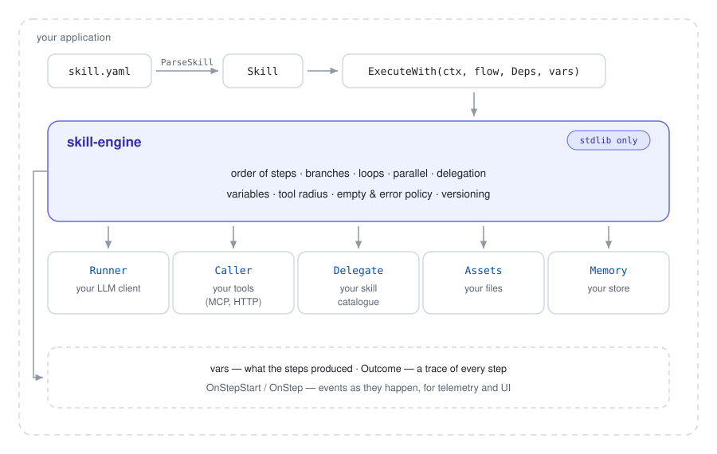

# skill-engine

**English** · [Русский](README.ru.md)

[](https://github.com/inhuman/skill-engine/tags)
[](https://github.com/inhuman/skill-engine/actions/workflows/ci.yml)
[](https://pkg.go.dev/github.com/inhuman/skill-engine)
[](https://goreportcard.com/report/github.com/inhuman/skill-engine)
[](https://go.dev/)
[](LICENSE)

**A deterministic runtime for one turn of an LLM agent.** A skill is a
declarative program — steps, branches, loops, a tool radius — and this library
executes it. The model decides *what* (classify, judge, word an answer); the
code decides *what runs next*. A restriction written into a prompt is a
request; a branch that does not exist cannot be taken.

```
go get github.com/inhuman/skill-engine
```

| | |
|---|---|
| **What it is** | a Go library, ≈8 800 lines, **zero dependencies** — the standard library alone |
| **Where it runs** | written for a home agent on a single 8 GB GPU; since adopted by an assistant in production, ~30 skills in its catalogue |
| **What it changed** | 23 skills over 5 280 live turns: **20 cheaper, 1 more expensive, 2 unchanged** in LLM generations per turn ([how it was measured](#the-problem-it-solves)) |
| **What it is not** | not durable, not scheduled, not an agent framework — a turn runs inside your application and ends with it ([the neighbours](#where-it-fits)) |

**Start here → [QUICKSTART.md](QUICKSTART.md).** Fifteen minutes, at the end of
which you have run the same skill BOTH ways — as a prompt and as steps — on the
same request, and seen the difference in what it cost and in what it did. Steps
1–5 need no model at all.

**Then → [`examples/`](examples/):** the format in
[`examples/skills/`](examples/skills/), and two working applications that embed
the engine — [`simple-llm-app`](examples/simple-llm-app/) on an
OpenAI-compatible endpoint with nothing but `net/http`, and
[`eino-llm-app`](examples/eino-llm-app/) with the model reached through a
framework. Both run offline in their tests.

## What it is

The engine is the **runtime of one turn**. It is not an agent, not a model
client and not a framework: it takes a description of a turn and executes it,
calling back into your application for everything that touches the outside
world.

- **A skill** is one YAML file: a header (name, trigger examples, servers,
  role) plus a description of the turn — either a program (`workflow`: steps,
  branches, loops) or a prompt (`playbook`). The file is data: your users can
  write it, your CI can lint it, and it is portable between hosts, which is why
  the FORMAT carries a version of its own.
- **The engine** owns the order of execution: which step runs next, which
  branch is taken, what a step is allowed to touch, what a variable holds, what
  happens when a step comes back empty or fails.
- **Your application** owns everything else — the model, the tools, storage,
  telemetry, the catalogue — and hands it over as interfaces in `Deps`.

**On the name.** The word "skill" here is not the vendor feature of the same
name (a folder with an instruction and files, handed to a model to read). Those
describe what a model is GIVEN; this describes what a runtime EXECUTES — the
model never sees the control flow and cannot skip a guard by not reading far
enough. If the word collides with something you already know, read "skill" as
"a declarative workflow for one agent turn", and the rest of this file follows.

## In 30 seconds

A turn that picks the sections of a menu the request names, fetches them, and
words an answer — the shape of any skill that has to look something up:

```yaml
# a fragment of examples/skills/menu.yaml
workflow:
  tools: [recipes]
  steps:
    - name: nothing_named                    # the honest exit
      when: "input not contains десерт | сладк | напит | чай | горяч | второе"
      exit: {reason: "the request names no section of the menu"}

    - name: pick_dessert                     # a tool call WITHOUT a generation
      when: "input contains десерт | сладк | dessert"
      call: {tool: "recipes:search", args: {section: dessert}, save_as: desserts}

    - name: pick_drink
      when: "input contains напит | чай | кофе | drink"
      call: {tool: "recipes:search", args: {section: drink}, save_as: drinks}

    - name: answer                           # the only step that costs a generation
      instruction: |
        The request: {{input}}
        Desserts: {{desserts}}
        Drinks: {{drinks}}
        Answer from what was found; say nothing about a section that came back empty.
      tools: []                              # this step gets NO tools, structurally
```

The application supplies the two things the engine cannot do itself and reads
the result:

```go
skill, err := skillengine.ParseSkill(raw, yaml.Unmarshal)   // your YAML parser
vars, outcome, err := skillengine.ExecuteWith(ctx, skill.Workflow, skillengine.Deps{
    Runner: myModel,     // you call the LLM
    Caller: myTools,     // you call the tools
}, map[string]string{"input": request})

fmt.Println(vars[skillengine.AnswerVar])
```

What actually happened is a structure, not a log to grep — this is real output
from [`examples/simple-llm-app`](examples/simple-llm-app/) with the model
stubbed:

```
=== steps ===
  nothing_named    exit        skipped  calls=0  condition ... is false
  pick_dessert     call        ok       calls=1
  pick_drink       call        ok       calls=1
  pick_main        call        skipped  calls=0  condition ... is false
  answer           instruction ok       calls=0
  skipped: nothing_named, pick_main
```

Three sections were considered, two were fetched, one was not, and the model
was used **once** — to word the answer. Which sections to fetch was decided by
a condition rather than by a generation, the fetches cost no tokens at all, and
a request naming no section leaves through `exit` before any of it. The same
file also carries the prose version of the same turn, so both can be run on the
same request: 227 tokens as a prompt against 102 as steps, and on a request
that names nothing the prose half answers anyway
([QUICKSTART.md](QUICKSTART.md) runs both halves).

## Architecture

<p align="center">
  <picture>
    <source media="(prefers-color-scheme: dark)" srcset="assets/architecture.dark.svg">
    
  </picture>
</p>

| | the engine | the application |
|---|---|---|
| decides | which step is next, which branch, what a step may touch | what a model call is, what a tool call is |
| holds | variables of the current turn only | sessions, history, storage, the catalogue |
| knows | the format and its version | the domain, the words, the models |
| after the turn | nothing — no state survives it | everything worth keeping |

**Zero dependencies is the consequence of that boundary.** The engine is
embedded into someone else's application, and every dependency here would
become a dependency of the embedder, with its versions and its conflicts. So
YAML parsing arrives as a parameter (the `Unmarshal` type), version comparison
is thirty lines rather than a library, and a guard test — `imports_test.go`,
test imports included — fails the build the moment production code imports
anything at all.

## Status

**Where it comes from.** It was written for a home agent running on one 8 GB
GPU, where a generation costs minutes you sit through and the token budget is
the card rather than an invoice. That is the constraint that shaped the format:
a turn that used to be one long prompt became steps, and the steps that need no
model do not pay for one.

**Where it runs now.** It has since been adopted by an assistant in production,
where it executes the whole skill catalogue — around thirty skills — and where
the measurement below comes from. So it is not a design sketch: every field in
the format is there because something broke without it, and the comment beside
the field says what.

**Library version — `v0.8.x`.** Below `1.0` the **Go API may still move**: a
type can gain a field, a function a parameter. What is already stable is the
**format** — skill files are versioned separately and on their own rules.

**Format version — `2.2.4`** (`EngineVersion` in `version.go`). A skill declares
the minimum it needs in `skill_engine_version`, and a foreign MAJOR is refused
in both directions: a description of a previous major would parse without a
single complaint, silently losing fields the structs no longer have. What
changed in each version, and what a migration does, is in
[CHANGELOG.md](CHANGELOG.md).

**If you have skills written for format 1.x**, they do not load: that is the
refusal above, working as intended. `Migrate(raw)` rewrites them — it edits the
file as text, so comments, key order and block scalars survive — but until you
run it those skills do not execute at all, including on a schedule. Better said
here than discovered on a Monday morning.

**Tests.** 90.1% statement coverage in the engine, 95.2% in the linter, plus
guard tests for the properties that prose cannot hold: no dependencies, no
direct reads of the variable map, the two schema translations staying
structurally identical, and the example applications staying separate modules.

## The problem it solves

A restriction written in words is a request: "do NOT call retract without
confirmation", "run the check EXACTLY once". It is followed exactly as far as
the model read before it started acting. In steps the same thing is expressed
structurally: in the unconfirmed branch the `retract` call **is not there**, a
`call` step cannot be repeated, a branch that does not apply does not run.

The second half of the problem is arithmetic. A turn left to the model is a
react loop: every decision — which tool, whether that was enough, what next —
is a generation, and every generation carries the whole context again. Moving
the decisions the code can make into the code removes those generations
outright, and the ones that remain are cheaper, because a step declares what it
is allowed to touch.

### What it changed, measured on live traffic

Not a benchmark of one question run twice — the event log of a working
installation: every turn where a skill matched, over five weeks, questions asked
by people rather than by the author of the skill. The metric is **LLM
generations per turn**, orchestrator and subagents together.

The catalogue moved from prose to steps on one day, and the periods are split by
that date.

| | |
|---|---:|
| skills with at least 5 turns on each side | **23** |
| turns compared | **5 280** (3 469 prose, 1 811 steps) |
| significantly cheaper (Mann–Whitney, p<0.05) | **20** |
| significantly more expensive | **1** |
| no significant difference | **2** |

The effect is a median of −18 to −0.5 generations per turn. The largest: a
triage skill went from a median of **38 generations per turn to 20**. Typical:
**7 → 3**.

**One skill got worse.** A health-checking skill went the other way — median
**6 → 10** generations, p<0.001. The measurement does not say why: it counts
generations, not reasons.

So steps are not automatically cheaper, and the format is not a substitute for
checking. Known ways a skill gets MORE expensive when it moves into steps:

- **an asset inside a step that has tools.** The knowledge rides along into
  every generation of the react loop, not just the first one. Splitting into
  "decide" (knowledge, no tools) and "do" (tools, no knowledge) is the fix;
- **splitting a turn that had nothing to split.** Two steps means two prompts,
  each carrying its own context. If the second step does not remove work from
  the first, it only adds a generation;
- **a decision that is genuinely open.** Wording an answer, judging quality,
  reading somebody's intent — a condition cannot replace that, and pretending
  otherwise just moves the model call somewhere less visible;
- **one or two steps and no branching at all** — prose is cheaper, and the
  format says so itself (see "A prompt works as well").

Every skill is worth measuring on its own after it is rewritten. This engine
gives you the trace to measure with (`Outcome.Steps`) and a linter for the
defects that stay quiet; it does not promise that a rewrite pays.

**Multiple comparisons.** Those 23 tests are 23 chances for a fluke, so: with
the Holm–Bonferroni correction **16 of the 23 stay significant — 15 cheaper and
the one that got more expensive**. The skills that drop out are mostly the ones
with the fewest turns, and the conclusion does not move. Worth noting that the
loss survives the correction too: it is not an artifact of testing many skills
at once.

**What this is and is not.** The periods are separated by a DATE, not by
randomisation, and other things changed in those same days — the engine was
being edited alongside the skills. So this is an **observational before/after
comparison, not an experiment**: it shows that the catalogue got cheaper across
that boundary, not that nothing else contributed. The underlying event log
belongs to a private installation, so what is published here is the aggregate
rather than the raw data.

### Two benefits, and they do not scale together

Fewer generations per turn is **fewer tokens**, and tokens are either an invoice
or an occupied GPU, plus the seconds someone spends waiting. That saving is
arithmetic and the same whatever model you run: a call removed is its cost
removed.

Whether the turn **lands** is a different benefit, and it depends on the model
reading the skill. A large model reads a long prose skill to the end and mostly
does what it says, guards at the bottom included — for it, steps save money more
than they change outcomes. A smaller model loses on that same prose: it falls
back to a default and drops what the request NAMED, which is exactly what the
dictionary measurement above shows — 5 of 10 against 10 of 10 with a condition,
where the difference is not the price but the answer.

So the smaller the model, the more of the value sits in behaviour rather than in
cost. That matters in practice, because a model running inside someone's own
perimeter is usually the one that fit on the GPUs rather than the largest one
there is.

**This is a hypothesis, not a result.** Checking it means running one catalogue
across model classes, and the measurement above comes from one installation
whose models are of one class. It explains those numbers rather than following
from them.

## Where it fits

Every neighbour below is better than this engine at the job it was built for.
The differences are architectural rather than a matter of taste, so they are
worth naming outright.

| | what it is for, and does better | why this is not that |
|---|---|---|
| **LangGraph** and agent frameworks | building an agent — a graph, memory, a model client, an ecosystem, in your application's language | there the graph is **code you deploy**; here the program is **data a skill's author writes**, portable between hosts. Hence a version on the format and `Migrate` for a major |
| **Temporal** and durable orchestrators | a process that must survive a crash, a deploy and three days of waiting: retries, timers, exactly-once, history | the engine keeps **no state between turns**, has no storage and does not survive a restart. Need durability — take Temporal, and run a turn inside an activity |
| **n8n**, Airflow | pipelines assembled in a UI or by hand, on a schedule, with hundreds of ready connectors | a turn here **starts from somebody's request** and its shape depends on the words in it. No scheduler, no UI, no server, no connectors |
| **BPMN** engines | a process a business analyst draws, with events, timers, compensation and a formal semantics behind it | the audience is a **skill's author**, not an analyst; the whole format is one schema file, and there are no events, no timers and no compensation in it |
| **MCP** | the protocol: how an agent reaches a tool at all | **orthogonal.** MCP says how a call is made, this says **which call happens and when**. The engine calls MCP tools through your `Caller`. What MCP cannot express is "in the unconfirmed branch this call does not exist" |

Two properties are rare enough to be worth naming where you are comparing:
the program is **data rather than code**, and the runtime brings **no
dependencies** into the application that embeds it.

**When you do NOT need this.** One or two steps and no branching — prose is
cheaper, and the format says so itself (see "A prompt works as well"). The
engine starts paying where a turn has branches, a loop, a tool set that must
narrow, or a guard that has to be impossible to violate rather than merely
asked for.

## Full documentation

Everything above is the whole idea; everything below is **reference** — worth
reading when you are writing a skill, not before.

| | |
|---|---|
| [QUICKSTART.md](QUICKSTART.md) | fifteen minutes, the same skill run as a prompt and as steps |
| [`examples/skills/`](examples/skills/) | the format itself — thirteen skills, each a commented example |
| [`examples/`](examples/) | two applications that embed the engine, both runnable offline |
| [skill.schema.yaml](skill.schema.yaml) | the source of truth for the format (`SchemaRU` is the same in Russian) |
| [handbook/](handbook/) | the failure classes and the forms that avoid them — in Russian, and reachable from code (`HandbookIndex`, `Handbook`) |
| [lint/README.md](lint/README.md) | the rule table, and what deliberately stays with the embedder |
| [CHANGELOG.md](CHANGELOG.md) | what changed in each format version, and what a migration does |

Below, in this file: ["A prompt works as well"](#a-prompt-works-as-well) — the
two ways to describe a turn and how to switch between them ·
["Example"](#example), ["Step kinds"](#step-kinds),
["Branching on the words of a request"](#branching-on-the-words-of-a-request),
["Shared step settings"](#shared-step-settings),
["When a step comes back empty"](#when-a-step-comes-back-empty),
["Variables"](#variables) — the format ·
["The contract with the application"](#the-contract-with-the-application) — the
Go API, `Deps`, `Outcome`, versions and migration ·
["Invariants paid for with live failures"](#invariants-paid-for-with-live-failures)
and ["Format pitfalls"](#format-pitfalls) — what breaks and why ·
["The library ships no words"](#the-library-ships-no-words) — the vocabulary you
declare · ["Checking a skill before it runs"](#checking-a-skill-before-it-runs) —
the linter.

## A prompt works as well

Starting with structure is not required. A skill has two ways to describe its
turn:

- `playbook` — a free-form instruction: what to do and what to look at;
- `workflow` — steps (`steps`, `tools`, `vars`, `assets`), i.e. everything
  below in this file.

The usual path is to write it as a prompt, debug it on live requests, and move
into steps whatever is worth it: structure costs time, and there is no reason
to pay for it before you know WHAT to structure. The measurements above are
about that move.

While the move is under way both descriptions can sit side by side, with the
`mode` field switching between them so their outcomes can be compared on live
requests — instead of deleting half the work just to check:

| `mode` | `workflow` | `playbook` | what runs |
|---|---|---|---|
| unset | present | present | `workflow` — structure outranks prose |
| unset | present | — | `workflow` |
| unset | — | present | `playbook` |
| unset | — | — | error: the skill describes no turn |
| `workflow` | present | any | `workflow` |
| `workflow` | — | present | **error**: the mode is set, there are no steps |
| `playbook` | any | present | `playbook` |
| `playbook` | present | — | **error**: the mode is set, there is no text |

An empty half under an explicit mode is a refusal, not a fallback to the other
one: switch the mode to `playbook`, forget to write the text, and you would
otherwise get a clean run over the old steps and the conclusion "in playbook
mode it works the same" — from a turn the `playbook` never took part in. The
first two errors are caught statically by the schema (`if/then` on `mode`); the
whole table is implemented by `ResolveMode`.

The engine reads only `workflow` — `Flow` has no `playbook` field. A skill
without steps is run by the embedding application its ordinary way: it is a
prompt, and the engine has nothing to do there. `ResolveMode` lives here
because "which of the two descriptions is in effect" is format semantics: were
it different in every host, skill portability would end silently.

## Example

```yaml
tools: [staging, exec]
steps:
  - name: understand                  # parse the request into fields
    instruction: |
      Request: {{input}}
      cluster — which cluster is named; namespace — the namespace name.
    tools: []                         # this step needs no tools
    model: vllm/gemma-4-e4b
    response_schema:
      type: object
      properties:
        cluster: {enum: [staging, sandbox]}
        namespace: {type: string}
      required: [cluster, namespace]   # see "Format pitfalls"
    save_as: req

  - name: fetch_pods                  # a call WITHOUT generation
    call:
      tool: kubectl_get
      args: {namespace: "{{req.namespace}}", resourceType: pod}
    on_server: "{{req.cluster}}"
    save_as: pods

  - name: report                      # a step without save_as writes the turn's answer
    instruction: |
      Pods: {{pods}}
      Answer: pod name → status.
    tools: []
```

## Step kinds

| step | what it does |
|---|---|
| `instruction` | generation by the model; `tools` sets the RADIUS — an empty list means "no tools" |
| `call` | a tool call without generation; arguments in YAML |
| `set` | assigning a variable |
| `switch` / `if` | branching on a variable's value |
| `for_each` | a loop over a collection, `collect` gathers the body's results |
| `parallel` | parallel branches; `<collect>.skipped` — those that did not run because of `when` |
| `delegate` | delegating to another skill (the application decides how to execute it) |
| `exit` | "matched by mistake" — the turn returns to its ordinary path |

## Branching on the words of a request

A condition compares with `==`, `!=`, `is [not] empty` — and with `contains`:

```yaml
- name: pick_dessert
  when: "input contains десерт | сладк | dessert"
  call: {tool: "recipes:search", args: {section: dessert}, save_as: found}

- name: nothing_named
  when: "input not contains десерт | сладк | напит | чай | горяч | салат"
  exit: {reason: "the request names no section of the menu"}
```

Any ONE alternative is enough, and an alternative may contain spaces. This
replaces a whole kind of step: a classifier whose only job is "which of these
words did the request name" already carries the mapping in its own text, so the
decision is deterministic and the model is there only to apply it. Measured on
ten live requests — the model at temperature 0 got **5 of 10**, the same
dictionary in a condition **10 of 10**, and three rewordings of the instruction
did not move the ceiling. Every miss was one kind: falling back to a default and
dropping what the request had NAMED.

Two properties are worth knowing before you write a dictionary:

- a match must begin where a **word starts**, and that is the default rather
  than an option — a false match is nearly impossible to debug because the
  condition looks right (`пуст` inside `перезапустить`, `search` inside
  `research`). Note that Go's `\b` is ASCII-only and would not have helped here
  at all;
- the **end is free**, so an alternative matches a word that starts with it.
  That is what lets a dictionary hold ROOTS — `заказ` finds `заказы`, `заказа`,
  `заказу` — and a dictionary of roots is why the format needs no stemming, which
  would be a guess about a language the engine does not know. The cost: a
  too-short root collides (`ком` finds `компонентах`), and the linter's W18
  warns when one alternative is already covered by a shorter one.

Regular expressions are deliberately absent: they would make skills unreadable
and open the door to catastrophic backtracking.

## Branching on a number

Counters, ids and thresholds parsed out of a request were in the flow all along,
and until 2.3.0 the only thing expressible about one was equality with a
literal. A comparison — `>`, `>=`, `<`, `<=` — reads in the same place, and the
right side may be a number or the name of a variable holding one, because a
threshold usually arrives from the step that parsed the request:

```yaml
- name: process_pods
  for_each:
    in: pods
    as: pod
    collect: hot
    steps:
      - name: check_restart
        if:
          cond: "pod.restartCount > req.threshold"
          then:
            - set: {var: hot, value: "{{pod.name}}"}
```

That is the shape the case arrives in: "keep the ones over the threshold" gets
written as a loop with a branch inside, which is why the format needs no
collection filter of its own. Before this, the same skill either asked the MODEL
to apply the threshold — a deterministic rule handed to the least deterministic
thing in the turn — or called an asset to compare two numbers.

Two rules, both of them there to keep a wrong branch from being invisible:

- an operand that is not a number **stops the turn** rather than quietly
  evaluating to false. A condition is the one place where a wrong answer leaves
  no trace: `restarts > 5` looks right whatever it returns;
- an empty variable is **not zero**. A step that returned nothing leaves
  `restarts` empty, and reading that as 0 makes "no data" indistinguishable from
  "few restarts" — the same reason `is empty` is a form of its own. Where
  emptiness is legal, `var is not empty` in front says so.

Two integers are compared as integers, so a nineteen-digit id does not lose its
last digits to float64. `==` stays textual: `"5" == "5.0"` is false, and the
equalities already written compare ids and sentinels. A variable is named
without `{{ }}` — the braces belong to substitution, and a condition takes the
name itself.

Arithmetic (`a + b > c`, `len(x) > 0`) is absent for the same reason as regular
expressions: those are expressions, and expressions are the door to skills that
cannot be read from top to bottom.

## Shared step settings

What repeats across a catalogue is usually not the step but its envelope. A
`profile` is that envelope under a name; anything the step spells out itself
wins, and `sampling` is replaced whole rather than merged key by key:

```yaml
profiles:
  classifier:
    model: small/model
    sampling: {temperature: 0}
    tools: []                    # an empty SET — the guard travels with it
steps:
  - name: understand
    profile: classifier
    instruction: …               # the work stays per-step
  - name: judge
    profile: classifier
    sampling: {temperature: 0.2} # one field, overridden here only
    instruction: …
```

## When a step comes back empty

An empty result used to be indistinguishable from content downstream: the next
step honestly ran `ok` on an empty input and the turn produced an empty answer
wearing the look of a successful one. `on_empty` says what the emptiness means:

| value | what happens |
|---|---|
| `continue` | legal, the flow moves on — the default, and the old behaviour |
| `fail` | the step counts as failed; `on_error` decides from there |
| `retry` | run it again `on_empty_retries` times (1..5); still empty is then `fail` |
| `use` | store `on_empty_value` instead (supports `{{var}}`) |

Empty means an empty string after trimming, judged on the value the step *would
store* — with `one_of` an ambiguous answer produces text and stores nothing, and
it is the stored value that flows on. It works on `call` steps too, except
`retry`: a call cannot be repeated.

## Variables

- `save_as` puts a step's result into a variable; **a step without `save_as`
  writes into `answer`** — that is where the application takes the turn's
  answer from. An empty `answer` = the program produced no answer.
- **A value inside a structured result is reached by a path**, in a
  substitution and in a condition alike: `{{pod.metadata.name}}`,
  `{{pod.status.containerStatuses[0].restartCount}}`, and the same written
  without braces on the left of a condition. An index is `[0]`; `[*]` and
  filters are refused, because a path resolves to ONE value and picking many is
  what `for_each` is for.

  **A path that does not resolve is an error, not an empty string.** Silence
  there is worse than useless: `a.b.c` with `b` missing is indistinguishable
  from "the value is empty", and branches are taken on it. The refusal says
  where the walk broke and what the object did have. A bare name and a single
  `var.field` keep their old silence — that promise is what skills already
  written were built on, and the linter's W14 is what watches it.
- `<name>.mem` — the working-memory handle of a result, ALWAYS, not only for
  large ones: `args: {stdin: {from: "{{tickets.mem}}"}}` sends the data past
  the model's context. It is read from the value's LAST line, where the host
  writes it: a `[mem:…]` quoted inside a diff, a log or a user's message is
  data, not a marker.
- `{{asset:name}}` substitutes an asset into TEXT (it passes through the
  context), `{from: "asset:name"}` — by REFERENCE (it does not).
- **A step without tools reads a variable whole.** A large result reaches a
  model as a fragment plus the host's note saying how to read the rest — which
  a step with tools follows by calling, and a step without tools cannot follow
  at all. Told to make a call it has no way to make, a model writes the call out
  as its answer (a live turn ended with the arguments of a memory call printed
  where a report was meant, and the step was recorded `ok`). So the addressee of
  a substitution is three, not two: a script or a call argument gets the
  payload, a model that CAN fetch more gets the fragment and the note, and a
  model that cannot gets the whole value.
- `<collect>.skipped` — branches skipped because of `when`. Without it the
  answering step cannot tell "the source answered nothing" from "we never went
  to the source".

## The contract with the application

```go
out, outcome, err := skillengine.ExecuteWith(ctx, flow, skillengine.Deps{
    Runner:   …, // executes an instruction step (generation)
    Caller:   …, // executes a call step (a tool)
    Delegate: …, // executes a delegate step
    Assets:   …, // resolves asset content                    (optional)
    Memory:   …, // returns a full result by its .mem handle   (optional)
    OnStep:   …, // a step's trace RIGHT AFTER it, not in bulk (optional)
}, vars)
```

- `out` — the variables **produced by the steps**; the `vars` passed in do not
  end up in the result. Otherwise a flow that did not fill in the answer hands
  the caller its own input — live case: a user got a transcript of their own
  messages in chat instead of an answer.
- `Outcome.Steps` — the trace of every step (name, kind, outcome, reason,
  duration, number of calls and failures);
- `Outcome.Skipped` — steps not executed because of `when`, **including those
  inside `parallel` branches**;
- the one asymmetry worth knowing: `Outcome.Steps` stops at a `parallel` — the
  steps INSIDE its branches are not there, while `Skipped` above does include
  them. A branch runs in a forked state, and only its variables and its skips
  are merged back at the join. Nothing is lost by it: branch steps reach
  `OnStep` as they happen, which is where per-step telemetry comes from.
  `Steps` is the flow's shape, `OnStep` is the event stream, and only the first
  one stops at the fork;
- `Outcome.AnsweredBy` — `instruction` or `call`: what wrote the answer. Needed
  so that post-processing does not rewrite a script's deterministic output.

Everything in `Deps` **must be safe for concurrent use**: within one turn the
branches of a `parallel` run at once, and across turns one `Deps` usually serves
the whole application. Ordinary clients already are; a hand-written double or a
callback accumulating into a slice is where it gets forgotten.

`OnStepStart` and `OnStep` in particular: they fire from
the goroutine that ran the step, and the branches of a `parallel` run in several
at once. A callback appending to a slice needs its own lock. The engine does not
serialise them on purpose — a lock there would hold up a branch for the duration
of somebody else's telemetry write.

The engine logs nothing, persists nothing and goes nowhere: the input and the
steps' output are the caller's data. Everything visible from outside is handed
over as a structure (`Outcome`) and through callbacks (`OnStepStart` — before a
step, for showing work to a human; `OnStep` — right after). Turning that into
telemetry is the embedding application's job.

The format's schema is `skill.schema.yaml` — the source of truth, embedded as
`SchemaYAML`, with `SchemaSummary` giving the compact version to hand a model.
`SchemaRU` / `SchemaSummaryRU` are the same in Russian: also embedded, so
`go mod vendor` carries them to whoever shows the schema to a skill author. A
test keeps the two structurally identical, so only the prose differs, and
validation always goes against the English one.

The format version is in `version.go`; `CheckEngineVersion` rejects both a
description from the future and one of a foreign major: the latter would parse
without a single complaint, silently losing fields the structs no longer have.
Since skills live in a user's storage and are not updated with a deploy, the
edits that a major needs ship with the code that makes them:

```go
out, changed, err := skillengine.Migrate(raw)
```

`Migrate` edits the file as text — comments, key order and block scalars
survive — and does not validate the result; parse and validate it as usual
afterwards. It takes a skill file as the format defines it, one YAML document:
if you keep skills inside a wrapper of your own (front matter, a markdown body),
strip it before the call and put it back after — a wrapped input is refused,
not guessed at. Format changes and what each migration does are in
`CHANGELOG.md`.

A skill file is more than its steps, so the whole file has a type too:
`ParseSkill(raw, unmarshal)` reads header and description into a `Skill`, and
`Skill.Validate()` checks the version, the header and the workflow in one go.
Every field of that header is already described by the schema — that is, it
belongs to the FORMAT — and yet each embedder used to declare its own struct for
it and re-derive the same rules; two copies of a contract drift, and the field
the engine gained is silently dropped by the copy.

## Invariants paid for with live failures

- **A failure must be loud.** `degraded` is set on a step with no text, on a
  fork where no branch ran, on a `switch` with no match and an empty `default`,
  on a loop with failed iterations, on a truncated answer. A silent failure
  here looks like success: the turn answers with an internal variable, and that
  reads as a finished answer.
- **One resolver per reference, and the addressee picks the form.** A variable
  holds what the host would show the MODEL — a large result arrives as a preview
  with a `[mem:id]` handle. A tool argument, a loop's collection and a condition
  need the whole thing with the note stripped. Every consumer used to sort that
  out for itself and one always forgot: the class fired four times in a day at
  an embedder, each time somewhere new. Now there are two ways to ask —
  `expand` for the model, `payload` for data — and a guard test fails the build
  if anything reads the variable map directly.
- **A mechanism added to the model's path must appear on the `call` path too.**
  Nine misses in a row, each found by a live failure: empty arguments, `{from:}`
  references, delivery, retries, request normalisation, provenance, argv
  repair, builtin tools, cross-turn memory.
- **Knowledge is expensive in a step WITH TOOLS**: an asset rides along into
  EVERY generation of the react loop. The cure is splitting it into "decide"
  (knowledge, no tools) and "do" (tools, no knowledge).

## Format pitfalls

- **`required` is the only lever.** A `strict` schema enforces only what is
  listed: a field in `properties` but not in `required` may legitimately not be
  sent by the model. Live measurement: `confidence` did not arrive ONCE out of
  26 findings, while 16 of them wrote the number in words inside the text.
- **A string field needs `maxLength`.** Otherwise the model writes until the
  token ceiling and breaks off mid-line, taking the whole document with it. The
  grammar holds the limit: `maxLength: 600` → exactly 600 characters and valid
  JSON.
- **`for_each.in` takes a variable NAME, not a template.** `in: "{{parts}}"`
  yields zero iterations and reports success (the engine now rejects that).
- **The exec envelope is not the payload.** `{{findings}}` is
  `{"exit_code":…,"stdout":"…"}`; a loop and the arguments need `.stdout`.

The joints between steps are where programs break, and static checks catch them
more cheaply than a run does. `Flow.Validate` is called before execution and
rejects what used to be reported as success; every new such class is closed off
by a check in validation rather than by a paragraph here. Running it over
descriptions before execution is worth it too — in CI, when a skill is written.

## The library ships no words

An agent about a kitchen, one about a car fleet and one about a warehouse share
this format and nothing else — not a domain, not a house style, not a language.
So the engine knows only the words it WRITES itself: the failure markers it
records (`ERROR:`, `DENIED:`) and the working-memory handle it defines
(`[mem:id]`). Everything else is declared by whoever embeds it:

```go
deps := skillengine.Deps{
    Runner: ..., Caller: ...,
    Vocabulary: skillengine.Vocabulary{
        // What YOUR model writes before naming its choice — used by `one_of`
        // to lift a decision out of prose.
        DecisionMarkers: []string{"Result:", "Résultat:", "结论:"},
        // How YOUR host marks a result it shortened — stripped before a value
        // reaches a tool argument, a loop or a condition.
        TruncationNotes: []string{"[shortened:"},
    },
}
```

An empty field is not a mistake: it means "my application has no such words",
and the mechanism that needed them steps aside. It never guesses. Leaving
`DecisionMarkers` empty costs one of five ways `one_of` normalises an answer,
and the narrowest one — an exact answer, a single value mentioned and a value
mentioned strictly more often all work without any words at all. Markers decide
only a tie, and there the result is empty rather than wrong; the step's trace
then names the field, so a missing declaration is visible instead of being
inferred from a quiet default.

The same applies to the linter: `Options.EmptyWords` and
`Options.FreeTextFields` carry the words W16 and W13 need, and without them
those rules skip with a recorded reason rather than passing a skill as clean.

## Checking a skill before it runs

`Validate` refuses what **cannot** run. What runs **badly** is the business of
`lint`, a subpackage under the same no-dependency rule:

```go
rep, err := lint.Lint(raw, facts, lint.Options{Unmarshal: yaml.Unmarshal})
```

30 rules, every one of them paid for by a broken turn, and every one about a
defect that stays QUIET: a loop collecting into a variable nobody writes gathers
nothing and reports success, a typo in a variable's name resolves to an empty
string, a required field the instruction allows to be empty sends the model into
whitespace up to the token ceiling.

The rules that need to know the installation — which servers are up, which tools
they carry, which built-in tools exist — take those facts from the embedder and
**skip with a recorded reason** when they are not given: a partial check must
never look like a clean one. Severity is the library's, the gate is yours.

The rule table, what deliberately stays with the embedder, and the one
limitation worth knowing before relying on it are in
[lint/README.md](lint/README.md).

## Tests

`example_flow_test.go` — runnable examples of the format, a good first entry
point. `examples_test.go` parses every file from `examples/skills/` with the engine: an
example that stopped parsing is worse than a missing one — it teaches the wrong
thing.
